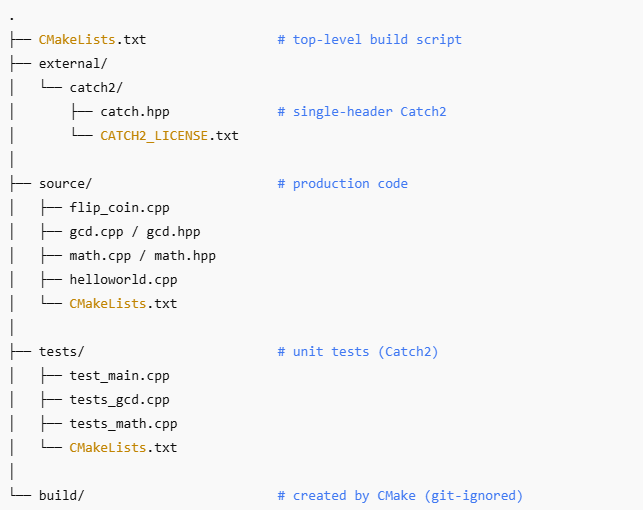

# Programmiersprachen – Assignment 1

Sommersemester 2025

> _“A first dive into modern C++: tool-chain, version control, basic syntax, and test-driven development.”_

---

## Table of Contents

1. [Overview](#overview)
2. [Repository Structure](#repository-structure)
3. [Prerequisites](#prerequisites)
4. [Build & Run](#build--run)
5. [Implemented Tasks 1.1 – 1.11](#implemented-tasks)
6. [References](#references)
7. [License](#license)

---

## Overview

This private repository contains my solutions to **Aufgabensammlung 1** of the _Programmiersprachen_ course (SS 2025).  
The exercises cover

- Git workflow & CMake (1.1, 1.2)
- Simple numerical problems and control flow (1.3 – 1.5)
- Randomness, I/O, and enumerations (1.6)
- A personal C++ glossary (1.7)
- Test-driven development with Catch2 (1.8 – 1.11)

All code targets **C++20**.

---

# Programmiersprachen – Assignment 1&nbsp; 

_A first dive into modern C++: tool-chain, version control, basic syntax, and test-driven development._

## Repository Structure

